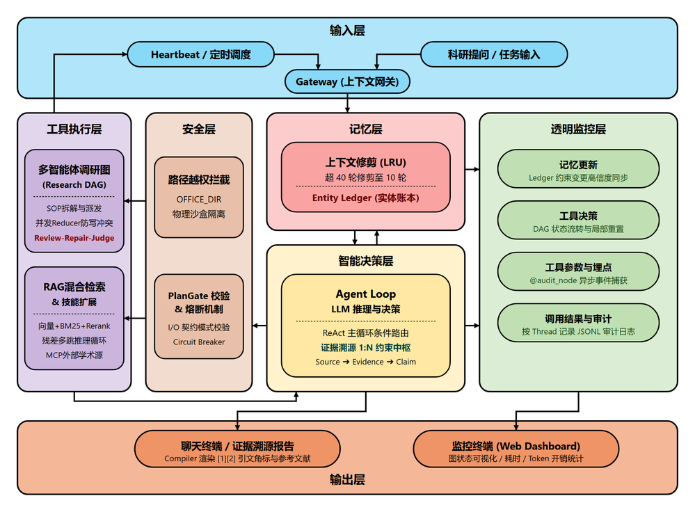
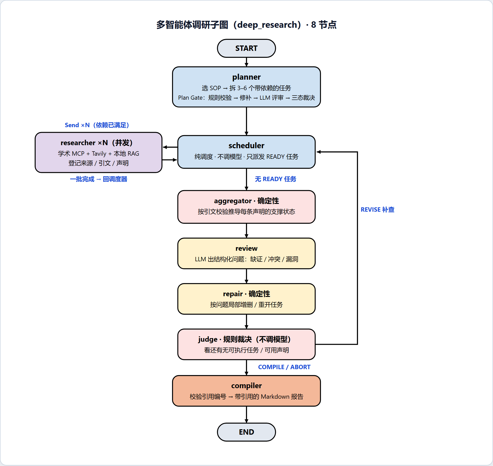

<div align="center">

# ClawAgent

### **科研智能助手 · 可溯源的调研与知识库问答**

导航: [简介](#-简介) · [核心能力](#-核心能力) · [快速开始](#-快速开始) · [系统架构](#-系统架构) · [子系统详解](#-子系统详解) · [内置工具](#-内置工具) · [配置](#-配置) · [目录结构](#-目录结构) · [文档](#-文档索引)

</div>

---

## 📖 简介

ClawAgent 是一个面向科研场景的智能体运行时，基于 **LangGraph** 构建。它解决的是两个具体问题：

1. **调研过程不可控** —— 通用大模型做文献调研时，任务拆解、检索、结论之间没有校验环节，检索轮数不可控，结论也无出处。
2. **出错难定位** —— 一次完整调研涉及十几个节点、几十次模型调用，出问题时无法回溯是哪一步、哪个任务、哪条证据出错。

围绕这两点，系统由三层组成：

- **运行时底座** —— 单进程 ReAct 主循环，按用户回合裁剪上下文，Entity Ledger 跨回合持久化全局硬约束，调研与 RAG 都以工具形式挂载。
- **调研与检索能力** —— 多智能体调研流水线（任务图 + 前置校验 + 依赖驱动并发 + 自动补查）与知识库 RAG（混合召回 + 精排 + 多跳推理）。
- **可观测性** —— 统一审计事件层覆盖 Run→Node→Task→Retrieval→Evidence→Claim→Citation→Report 全链路，事件落 JSONL，配套本地只读 Dashboard。

技能以目录形式挂载在 `workspace/office/skills/`，懒加载（启动时只扫元数据，首次调用才读全文），支持 `SKILL.md`（YAML frontmatter）与 `src/SKILL.md` 三层结构。

---

## 🌟 核心能力

| 能力 | 实现要点 |
|------|---------|
| **多智能体调研** | LangGraph 子图，8 个节点：`planner → scheduler ⇄ researcher → aggregator → review → repair → judge → compiler`；`Send` 依赖驱动并发 |
| **Plan Gate 前置校验** | 拆任务后先过确定性规则校验 → 自动修补（最多 2 轮）→ LLM 评审 1 次 → 三态裁决；REJECT 时按 SOP 维度生成兜底计划 |
| **证据溯源链** | 来源登记 → 引文定位校验 → 声明支撑状态推导 → 引用编号校验 → 落 SQLite，报告每条结论可追回原始检索式 |
| **私有知识库 RAG** | 向量(Chroma) + BM25(jieba) 双路召回 → RRF 融合 → bge-reranker 精排 → 片段过滤；父块/子切片两级分层 |
| **多跳推理 RAG** | 检索-推理循环，模型输出结构化决策 `RetrievalDecision`，程序按证据去重与缺口重复检测判定终止，硬上限 `RAG_MAX_ITERS`(默认 4) |
| **学术源 MCP 接入** | `langchain-mcp-adapters` 接入 arXiv / Semantic Scholar / PubMed，与 Tavily、本地 RAG 三路合并去重 |
| **可靠性降级** | 重试 → 方法级熔断器（连续失败 3 次开闸）→ 升级模型 → SQLite 死信队列（重试 3 次）→ 降级返回 |
| **全链路审计** | 统一 `AuditEvent`（12 字段），7 类共 20+ 事件，异步落 JSONL，写入失败不影响主流程 |
| **只读 Dashboard** | JSONL 增量索引到 SQLite，展示 Run 列表 / 总览指标 / 节点流水线 / 任务拓扑 DAG / 证据溯源 / 事件流 |
| **Shell 沙盒** | 命令在 `python:3.10-slim` 容器内执行，路径经 `os.path.realpath` 校验防软链接越权 |
| **多层记忆** | 长期画像(Markdown) + 近期摘要(按回合裁剪) + Entity Ledger(全局硬约束/已确认实体/未决问题) |
| **多模型适配** | OpenAI 兼容(OpenAI / 阿里云 / 腾讯 / Z.AI) / Anthropic / Ollama 工厂模式统一接入 |

---

## 🚀 快速开始

### 1️⃣ 安装

```bash
git clone <你的仓库地址>
cd ClawAgent

python -m venv venv
source venv/bin/activate        # Windows: venv\Scripts\activate
pip install -e .
```

> 可选外部依赖：**Docker**（Shell 沙盒工具）、**uv**（`pip install uv`，学术 MCP server 由 `uvx` 按需拉起）。
> 缺这两个依赖不影响主流程，对应工具会自动跳过或降级。

### 2️⃣ 配置

```bash
clawgent config    # 交互式向导，自动测试连接
# 或手动：cp .env.example .env
```


最小可用配置（主对话模型，以阿里云为例）：

```bash
DEFAULT_PROVIDER=aliyun
DEFAULT_MODEL=glm-5
OPENAI_API_KEY=sk-xxx
OPENAI_API_BASE=https://dashscope.aliyuncs.com/compatible-mode/v1
```

完整配置项见 [配置](#-配置) 一节。

### 3️⃣ 启动

```bash
clawgent                    # 交互式对话终端
python entry/monitor.py     # 另开窗口：实时审计监控
python -m entry.dashboard   # 另开窗口：只读 Dashboard（默认 http://127.0.0.1:8765）
```


Dashboard 提供一次 Research Run 的完整追踪：Run 列表 / 总览指标（耗时、任务闭环、证据数、核验率、多跳轮次、可靠性事件）/ 节点流水线 / 任务拓扑 DAG / 检索迭代 / 证据溯源 / 事件流，只读不改调研状态。


详见 [docs/OBSERVABILITY.md](docs/OBSERVABILITY.md)。

### 4️⃣ 可选：开启学术检索

```bash
# .env
ACADEMIC_MCP_ENABLED=true
SEMANTIC_SCHOLAR_API_KEY=   # 可选，提升速率上限
PUBMED_API_KEY=             # 可选，生物医学源

pip install uv
uvx arxiv-mcp-server --help   # 验证 arXiv MCP 可用
```

启用后，对话中直接说「查一下 arXiv 上关于 Mamba 架构的论文」即可。单个 MCP server 连接失败自动跳过，不阻断其余源。

### 5️⃣ 可选：高质量 PDF 解析

```bash
# .env（学术 PDF 含公式/双栏时推荐）
RAG_PDF_BACKEND=mineru
MINERU_API_KEY=your_key
```

把论文 PDF 放入 `workspace/knowledge_base/`，对话中说「重建知识库索引」即可。MinerU 失败自动降级 PyPDF2，不阻断索引。

---

## 🏗️ 系统架构



```
                    ┌──────────────────────────────┐
  用户 ────────────▶│   主 Agent 循环（LangGraph）    │
                    │  agent_node ⇄ ToolNode        │
                    │  tools_condition 自动路由      │
                    └──────────────┬───────────────┘
        ┌──────────────┬───────────┼────────────┬──────────────┐
        ▼              ▼           ▼            ▼              ▼
   ┌─────────┐  ┌───────────┐ ┌─────────┐ ┌──────────┐ ┌────────────┐
   │多层记忆 │  │Docker 沙盒│ │Agentic  │ │多智能体  │ │学术 MCP    │
   │画像+摘要│  │文件/Shell │ │RAG      │ │调研子图  │ │arXiv 等    │
   │+Ledger  │  │           │ │混合检索 │ │8 节点    │ │            │
   └─────────┘  └───────────┘ └─────────┘ └──────────┘ └────────────┘
                                    │            │
                    ┌───────────────▼────────────▼──────────┐
                    │  统一审计事件层 → JSONL → SQLite 索引   │
                    │  monitor.py 实时回放 / dashboard 只读  │
                    └───────────────────────────────────────┘
```

**多智能体调研子图（`deep_research`）：**



- `scheduler` 只派发依赖已满足的 READY 任务，不是一次性全量并发。
- `judge` 用 `Command` 路由：回 `scheduler` 补查，或进 `compiler` 成文。
- 节点级另有重试策略：LLM 类 3 次、网络类 2 次。

---

## 🧩 子系统详解

### 🔬 多智能体调研（[core/research/](clawgent/core/research/)）

`deep_research` 工具触发独立 LangGraph 子图：

| 节点 | 职责 |
|------|------|
| **Planner** | 按关键词选定研究 SOP，拆 3-6 个带依赖的任务 |
| **Plan Gate** | 拆完先校验：结构（无环/依赖存在）→ SOP 覆盖 → 证据依赖 → 冗余 → 粒度 |
| **Scheduler** | 不调模型，只把依赖已满足的任务用 `Send` 派出去 |
| **Researcher** | 学术 MCP + Tavily + 本地 RAG 三路混合检索，登记来源、引文与声明 |
| **Aggregator** | 按引文校验结果推导每条声明的支撑状态（确定性计算，不调模型） |
| **Review** | 出结构化问题：缺证、事实冲突、逻辑漏洞 |
| **Repair** | 按问题局部增删任务，新增数受 `MAX_REPAIR_TASKS` 限制 |
| **Judge** | 规则裁决（不依赖模型打分）：补查还是成文 |
| **Compiler** | 校验引用编号，产出带引用与支撑状态的 Markdown 报告 |

**Plan Gate 三态裁决**：`ALLOW` / `ALLOW_WITH_WARNINGS` / `REJECT`。判 REJECT 时不报废，改按 SOP required 维度逐个建最小任务的兜底计划（`build_fallback_plan`），不再调模型、直接复检，原因写进报告开头。裁决本身是规则判定——看终态是否残留 HIGH 问题；LLM 评审只产出问题清单。

**并发写冲突**：`state.py` 里被并发写入的字段（tasks / sources / evidences / claims）都用按 id 合并的 reducer，不是追加也不是覆盖。

**持久化**：`ResearchStore`（SQLite）10 张表，以 `run_id` 串联 runs / tasks / sources / evidences / claims / claim_evidence / task_results / issues / ledger_events / plan_gates。

详见 [docs/DEEP_RESEARCH_README.md](docs/DEEP_RESEARCH_README.md)。

### 📄 Agentic RAG（[core/rag/](clawgent/core/rag/)）

两级分流：

| 工具 | 适用 | 管线 |
|------|------|------|
| `search_knowledge_base` | 单点事实查询 | `search_agentic()`：策略判定 → 混合召回 → RRF → Rerank → 片段过滤 → 充分性门控 |
| `deep_query_knowledge_base` | 多跳 / 跨文档综合 | `search_iterative()`：检索-推理循环 → 综合 |

**多跳终止条件**：模型每轮输出结构化决策 `RetrievalDecision`（缺口 / 检索意图 / 下一检索式 / 期望证据 / 停否），由程序判定是否继续——模型说已充分、检索式与已查重复、无新证据（按 `evidence_id` 去重）、缺口连续两轮相同、决策非法、达 `RAG_MAX_ITERS` 硬上限，六种情况停止。是否继续是规则判定，不是模型决定。

**可靠性**：每个 LLM 决策点经 `llm_call_with_reliability` 包装——重试 → 方法级熔断器（连续失败 3 次开闸）→ 升级模型一次 → SQLite 死信队列（重试 3 次）→ 降级返回。调研侧节点走 `research/reliability.py` 的同一包装，叠加节点级重试策略。

**存储**：Chroma 双集合持久化（子切片向量检索，父块 ID 回溯取完整上下文）；BM25 语料绑定子切片。

详见 [docs/RAG_README.md](docs/RAG_README.md)。

### 📊 监控、审计与 Dashboard（[core/audit.py](clawgent/core/audit.py) + [core/dashboard/](clawgent/core/dashboard/)）

统一 `AuditEvent`（含 run/node/task 层级、耗时、状态、错误），7 类共 20+ 事件：

| 分类 | 事件 |
|------|------|
| 运行生命周期 | `run_start` / `run_end` |
| 节点生命周期 | `node_start` / `node_end` |
| 任务生命周期 | `task_created` / `task_ready` / `task_started` / `task_completed` / `task_failed` / `task_reopened` / `task_skipped` |
| 调用与可靠性 | `llm_call` / `tool_call` / `retry` / `fallback` / `circuit_breaker` |
| 检索 | `rag_iteration` / `rag_retrieval` / `rerank` / `multi_hop_iteration` |
| 调研决策 | `plan_gate` / `aggregation` / `review_issue` / `repair` / `judge_decision` |
| 溯源 | `evidence_registered` / `citation_verified` |

- 节点用 `@audit_node` 装饰，进出各发一条事件，写入 JSONL。
- `emit` 永不抛错：写盘失败最多打印一条 warning，不阻断业务。
- JSONL 是审计唯一数据源，SQLite 只是 Dashboard 的查询索引，由 `AuditIndexer` 增量重建。
- 不存证据正文，只存 id / 状态 / 来源类型。

验证链路：`python scripts/demo_audit_run.py` 生成一次完整事件链用于查看 Dashboard。

详见 [docs/OBSERVABILITY.md](docs/OBSERVABILITY.md)。

### 🧠 运行时底座（[core/agent.py](clawgent/core/agent.py)）

- **主循环**：ReAct 节点 + ToolNode，`tools_condition` 判断本轮是否要调工具。
- **上下文裁剪**：`trim_context_messages(trigger_turns=40, keep_turns=10)`，按完整对话回合裁剪，保留最近 10 轮。
- **Entity Ledger**：跨回合持久化的研究状态——全局硬约束 / 已确认实体 / 未决问题，每轮只把当前生效的约束注入提示词，不全量塞入。详见 [docs/ENTITY_LEDGER_DESIGN.md](docs/ENTITY_LEDGER_DESIGN.md)。
- **长期画像**：`workspace/memory/user_profile.md`，每轮注入系统提示词，由 `save_user_profile` 工具更新。

---

## 🔧 内置工具

| 工具 | 功能 |
|------|------|
| `deep_research` | 多智能体调研，输出带引用与支撑状态的结构化报告 |
| `search_academic` | 学术论文检索（arXiv / Semantic Scholar / PubMed，MCP 接入） |
| `search_knowledge_base` | 私有知识库单轮查询 |
| `deep_query_knowledge_base` | 私有知识库多跳深挖 |
| `rebuild_knowledge_index` | 重建向量索引（新增/修改文档后） |
| `get_current_time` | 当前系统时间 |
| `calculator` | 数学表达式计算 |
| `get_system_model_info` | 当前 provider / model |
| `save_user_profile` | 更新长期画像 |
| `schedule_task` / `list_scheduled_tasks` / `modify_scheduled_task` / `delete_scheduled_task` | 定时/循环任务（含时间歧义确认） |
| `list_office_files` / `read_office_file` / `write_office_file` | office 工位文件操作 |
| `execute_office_shell` | Docker 容器内 Shell 执行 |

外部技能（`workspace/office/skills/`）经懒加载器注册为动态工具。

---

## ⚙️ 配置

所有配置读自 `.env`（`python-dotenv` 加载），默认值见 [clawgent/core/config.py](clawgent/core/config.py)。

| 分组 | 变量 | 默认 | 说明 |
|------|------|------|------|
| 模型 | `DEFAULT_PROVIDER` | `aliyun` | `openai` / `anthropic` / `aliyun` / `tencent` / `z.ai` / `ollama` / `other` |
| | `DEFAULT_MODEL` | `glm-5` | 模型名 |
| | `OPENAI_API_KEY` / `OPENAI_API_BASE` | — | OpenAI 兼容接口 |
| | `ANTHROPIC_API_KEY` / `ANTHROPIC_BASE_URL` | — | 仅 `provider=anthropic` |
| | `OLLAMA_BASE_URL` | `http://localhost:11434` | 仅 `provider=ollama` |
| RAG | `RAG_EMBEDDING_MODEL` | `BAAI/bge-large-zh-v1.5` | 走 SiliconFlow 兼容接口 |
| | `RAG_EMBEDDING_API_KEY` | — | 必填，否则走降级 |
| | `RAG_RERANKER_MODEL` | `BAAI/bge-reranker-v2-m3` | 远程 Cross-Encoder 精排 |
| | `RAG_RERANKER_API_KEY` | — | 必填 |
| | `RAG_LLM_MODEL` / `RAG_LLM_API_KEY` / `RAG_LLM_BASE_URL` | `DeepSeek-V4-Flash` | 多查询扩写等判定类调用 |
| | `RAG_LLM_ESCALATION_MODEL` | 空（关闭） | 熔断后升级模型，留空则直接降级 |
| | `RAG_TOP_K` / `RAG_INITIAL_TOP_K` | `4` / `15` | 最终返回数 / 召回候选数 |
| | `RAG_MAX_ITERS` | `4` | 多跳循环硬上限 |
| | `RAG_PDF_BACKEND` | `pypdf2` | `pypdf2` \| `mineru` |
| | `MINERU_API_KEY` / `MINERU_API_BASE` | — | MinerU 后端 |
| 调研 | `TAVILY_API_KEY` | — | 联网检索 |
| | `RESEARCH_MAX_CONCURRENT` | `5` | 并发上限 |
| | `ACADEMIC_MCP_ENABLED` | `false` | 学术 MCP 总开关 |
| | `SEMANTIC_SCHOLAR_API_KEY` / `PUBMED_API_KEY` | — | 可选，提额度 |
| 审计 | `AUDIT_ENABLED` | `true` | 审计总开关 |
| | `AUDIT_LOG_DIR` | `logs/` | JSONL 落盘目录 |
| | `AUDIT_INDEX_PATH` | `logs/audit_index.sqlite` | Dashboard 索引 |
| | `DASHBOARD_HOST` / `DASHBOARD_PORT` | `127.0.0.1` / `8765` | Dashboard 监听地址 |
| 其他 | `CLAWGENT_WORKSPACE` | `workspace/` | 运行时根目录 |

---

## 📁 目录结构

```
ClawAgent/
├── clawgent/
│   └── core/
│       ├── agent.py              # 主 Agent 循环（ReAct + ToolNode）
│       ├── context.py            # 上下文裁剪与消息管理
│       ├── entity_ledger.py      # Entity Ledger（全局硬约束 / 实体 / 未决问题）
│       ├── provider.py           # 多模型工厂
│       ├── config.py             # 全局路径与各子系统配置
│       ├── logger.py             # 异步 JSONL 日志器
│       ├── audit.py              # 统一审计事件层（emit / span / summarize）
│       ├── skill_loader.py       # 懒加载技能加载器
│       ├── dashboard/
│       │   ├── indexer.py        # 审计事件增量索引（SQLite）
│       │   ├── server.py         # 只读 Dashboard HTTP 服务
│       │   └── static/           # 单页前端（列表/时间线/DAG/溯源）
│       ├── tools/
│       │   ├── builtins.py       # 内置工具注册表
│       │   ├── rag_tools.py      # RAG 工具封装
│       │   ├── research_tool.py  # 调研工具封装
│       │   ├── academic_tool.py  # 学术检索工具（MCP 封装）
│       │   └── sandbox_tools.py  # Docker 沙盒文件/Shell 工具
│       ├── rag/
│       │   ├── service.py        # 检索服务（search_agentic / search_iterative）
│       │   ├── retrieval_decision.py  # 多跳结构化决策与停止判定
│       │   ├── vector_store.py   # Chroma 双集合 + BM25
│       │   ├── pdf_backends.py   # 可插拔 PDF 后端（PyPDF2 / MinerU API）
│       │   ├── loader.py         # 文档加载器
│       │   └── reliability.py    # 熔断器 + 死信队列
│       └── research/
│           ├── graph.py          # 调研子图（8 节点）
│           ├── nodes.py          # 各节点实现
│           ├── plan_validation.py # Plan Gate：规则校验 / 修补 / LLM 评审 / 裁决
│           ├── sop.py            # 研究 SOP（应覆盖的维度）
│           ├── dag.py            # 任务 DAG 与状态机
│           ├── state.py          # 状态定义与按 id 合并的 reducer
│           ├── store.py          # SQLite 持久化（10 张表）
│           ├── search.py         # 学术 + 联网 + 本地三路混合检索
│           ├── claim.py / evidence.py / citation.py / conflict.py  # 溯源链
│           ├── ledger.py         # 研究账本事件
│           ├── semantic.py       # 语义判定辅助
│           └── reliability.py    # 调研侧可靠性包装
├── entry/
│   ├── cli.py                    # clawgent 命令入口 + 配置向导
│   ├── main.py                   # 交互式对话终端
│   ├── monitor.py                # 实时审计监控终端
│   └── dashboard.py              # Dashboard 启动入口
├── scripts/
│   ├── demo_audit_run.py         # 生成一次完整审计事件链
│   ├── generate_dashboard.py     # Dashboard 静态产物生成
│   └── mock_stream_monitor.py    # mock 模式下的流式监控
├── workspace/                    # 运行时数据（自动创建）
│   ├── memory/                   # 长期画像
│   ├── office/                   # 沙盒工位（唯一可执行区）
│   │   └── skills/               # 外部可插拔技能
│   ├── knowledge_base/           # RAG 语料（txt/md/pdf）
│   ├── kb_index/                 # Chroma 向量索引 + 死信队列
│   ├── research.sqlite3          # 调研持久化库
│   ├── state.sqlite3             # LangGraph checkpoint
│   └── tasks.json                # 定时任务持久化
├── docs/                         # 子系统与设计文档
└── requirements.txt · setup.py · .env.example
```

---

## ✅ 测试

```bash
python -m pytest tests/ -q
```

`tests/` 下 18 个测试文件、221 个用例，覆盖调研流水线、Plan Gate、多跳决策、溯源链、审计事件与 Dashboard 索引。

---

## 📚 文档索引

| 文档 | 内容 |
|------|------|
| [docs/ARCHITECTURE.md](docs/ARCHITECTURE.md) | 系统拓扑与工程决策 |
| [docs/DEEP_RESEARCH_README.md](docs/DEEP_RESEARCH_README.md) | 多智能体调研流水线 |
| [docs/RAG_README.md](docs/RAG_README.md) | RAG 检索链路与配置 |
| [docs/OBSERVABILITY.md](docs/OBSERVABILITY.md) | 审计事件、Dashboard 与已知限制 |
| [docs/ENTITY_LEDGER_DESIGN.md](docs/ENTITY_LEDGER_DESIGN.md) | Entity Ledger 数据模型与更新规则 |
| [docs/LAZY_LOADING_GUIDE.md](docs/LAZY_LOADING_GUIDE.md) | 技能懒加载机制 |

---

## 📄 License

[MIT](LICENSE) · 受 [OpenClaw](https://github.com/openclaw/openclaw) 启发。

<div align="center">

**👾 ClawAgent · 科研智能助手 · 可溯源的调研与知识库问答**

</div>
